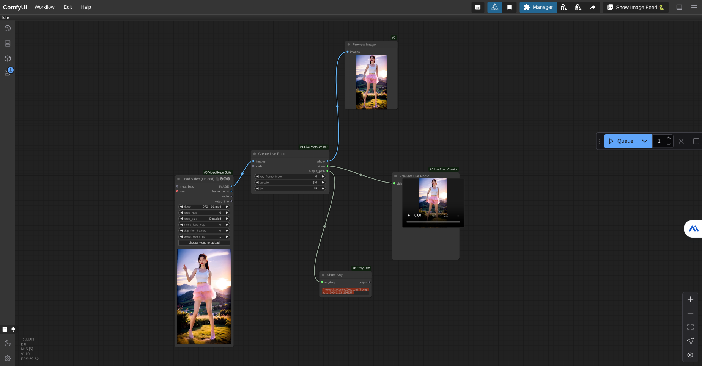

# ComfyUI LivePhoto Creator

A custom node for ComfyUI that allows you to create iPhone-compatible Live Photos from videos. This node can convert video sequences into Live Photo format, with the ability to select key frames and customize the output.

## Features

- Create Live Photos from video sequences
- Preview Live Photos with hover effect
- Support for custom key frame selection
- Adjustable FPS and duration
- Optional audio support
- Standard output format compatible with iPhone



## Installation

1. Clone this repository into your ComfyUI custom nodes directory:
```bash
cd ComfyUI/custom_nodes
git clone https://github.com/yourusername/ComfyUI-LivePhotoCreator
```

2. Install the required dependencies:
```bash
pip install opencv-python pillow
```

3. Make sure you have FFmpeg installed on your system:
- For Ubuntu/Debian:
  ```bash
  sudo apt-get install ffmpeg
  ```
- For Windows: Download and install from [FFmpeg website](https://ffmpeg.org/download.html)
- For macOS:
  ```bash
  brew install ffmpeg
  ```

4. Restart ComfyUI

## Usage

### LivePhotoCreator Node

The LivePhotoCreator node takes the following inputs:
- **images**: Image sequence (IMAGE type)
- **key_frame_index**: Index of the frame to use as the static image (default: 0)
- **duration**: Duration of the Live Photo in seconds (1-5 seconds)
- **fps**: Frame rate of the output video (1-60 fps)
- **audio**: Optional audio input

Outputs:
- **photo**: Selected key frame as static image
- **video**: Path to the generated video file
- **output_path**: Path to the output directory

### LivePhotoPreview Node

The LivePhotoPreview node allows you to preview the created Live Photo:
- Input: Takes the video path from LivePhotoCreator
- Output: Interactive preview with hover effect

## Example Workflow

1. Load your video using the "Load Video" node
2. Connect the video output to LivePhotoCreator
3. Configure the desired key frame, duration, and FPS
4. Connect LivePhotoPreview to see the result
5. The output files will be saved in the ComfyUI output directory under a timestamp-based folder

## Output Format

The node creates two files in the output directory:
- `IMG.JPG`: The static image
- `IMG.MOV`: The video component of the Live Photo

These files are named and formatted to be compatible with iPhone's Live Photo feature.

## Notes

- The video duration must be between 1 and 5 seconds to be compatible with iPhone Live Photos
- The output video is automatically scaled to maintain quality while keeping file size reasonable
- Audio support is optional and will be included if provided
- Preview requires mouse hover to play the video portion

## Requirements

- ComfyUI (latest version)
- Python 3.x
- OpenCV-Python
- Pillow
- FFmpeg

## Troubleshooting

If you encounter any issues:

1. Make sure FFmpeg is properly installed and accessible from command line
2. Check that all required Python packages are installed
3. Verify that the input video is valid and not corrupted
4. Check the ComfyUI console for error messages

## Known Issues

- Preview may not work in some browsers that block autoplay
- Very large videos may take longer to process

## Contributing

Contributions are welcome! Please feel free to submit a Pull Request. For major changes, please open an issue first to discuss what you would like to change.

## License

This project is licensed under the Apache License 2.0 - see below for details:

```
Copyright 2024

Licensed under the Apache License, Version 2.0 (the "License");
you may not use this file except in compliance with the License.
You may obtain a copy of the License at

    http://www.apache.org/licenses/LICENSE-2.0

Unless required by applicable law or agreed to in writing, software
distributed under the License is distributed on an "AS IS" BASIS,
WITHOUT WARRANTIES OR CONDITIONS OF ANY KIND, either express or implied.
See the License for the specific language governing permissions and
limitations under the License.
```

## Credits

- Based on ComfyUI by [ComfyUI Team](https://github.com/comfyanonymous/ComfyUI)
- Uses FFmpeg for video processing

## Contact

If you have any questions, feel free to:
- Open an issue
- Start a discussion
- Contact me through GitHub
